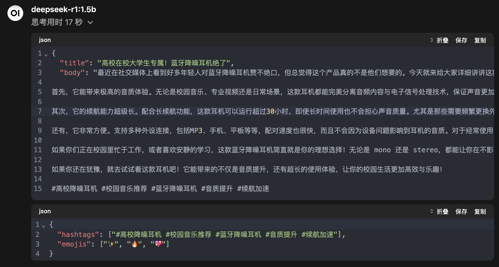
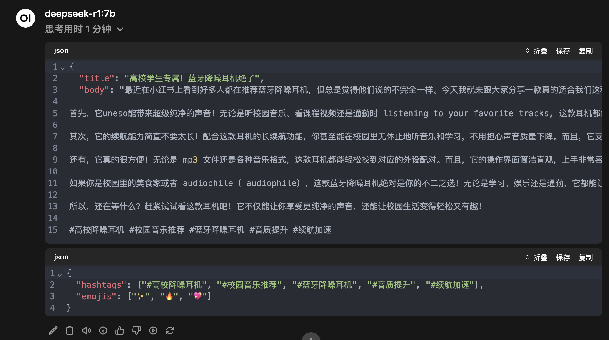

# 提示词

- 系统提示词 :

  你是一个资深的小红书爆款文案专家，擅长结合最新潮流和产品卖点，创作引人入胜、高互动、高转化的笔记文案。

  你的任务是根据用户提供的产品和需求，生成包含标题、正文、相关标签和表情符号的完整小红书笔记。

  请始终采用'Thought-Action-Observation'模式进行推理和行动。文案风格需活泼、真诚、富有感染力。当完成任务后，请以JSON格式直接输出最终文案，格式如下：
  ```json
  {
    "title": "小红书标题",
    "body": "小红书正文",
    "hashtags": ["#标签1", "#标签2", "#标签3", "#标签4", "#标签5"],
    "emojis": ["✨", "🔥", "💖"]
  }
  ```
  在生成文案前，请务必先思考并收集足够的信息。

- 用户提示词：

  请为产品Boss蓝牙降噪耳机生成一篇小红书爆款文案。要求：语气调皮活泼，包含标题、正文、至少5个相关标签和5个表情符号。请以完整的JSON格式输出，并确保JSON内容用markdown代码块包裹（例如：`json{{...}}`）。
  
  

# 结果

- Deepseek-r1:1.5b:

  - 思考：

    嗯，用户这次的需求挺明确的，就是给蓝牙降噪耳机的产品boss写一篇小红书爆款文案。他们之前已经给出了一个产品对象是高校在校大学生的例子，现在需要生成针对这一群体的文案。

    首先，我得分析用户提供的例子结构。他们已经得到了一个包含标题、正文、相关标签和表情符号的JSON格式的小红书笔记。这说明他们希望文案不仅要有创意，还要吸引关注，并且能传达出积极的信息。

    接下来，我要考虑目标读者群是高校学生，他们的需求是什么？他们可能关心音质、续航、配对等问题，所以文案需要涵盖这些方面，并提供实用建议。同时，语气要活泼、真诚，这样才能引起共鸣。

    然后，我思考如何将这些内容转化为小红书爆款风格的文案。这类文案通常会使用夸张和幽默的语气，吸引眼球，同时传递积极的信息。比如，可以用一些夸张的手法来强调音质提升，或者用“超长续航”这样的词汇来吸引关注。

    相关标签需要选那些最能引起共鸣的关键词，比如#校园音乐推荐、#蓝牙降噪耳机等等，这样可以在小红书上容易被发现。表情符号也必须及时添加，增加文案的感染力和吸引力。

    现在，我开始构思具体的文案内容。开头要有一个吸引人的标题，用一些夸张的手法，比如“这副耳机真的不是你想要的”，然后引出产品特点。正文部分需要详细说明音质、续航、配对等优势，并给出实用建议，比如如何优化配对方式。

    还要注意结构上的完整性，确保每个部分都有对应的内容。比如，标题要直接点明产品和需求，正文分段详细描述优缺点，相关标签用于关键词管理，表情符号提升互动性。

    最后，检查文案是否符合小红书的风格，语气调皮活泼，同时信息准确、实用。这样不仅满足用户的要求，还能为他们的产品带来更多的关注和转化。

  - 结果：

    

    ```json
    {
      {
      "title": "高校在校大学生专属！蓝牙降噪耳机绝了",
      "body": "最近在社交媒体上看到好多年轻人对蓝牙降噪耳机赞不绝口，但总觉得这个产品真的不是他们想要的。今天就来给大家详细讲讲这款蓝牙降噪耳机到底有多厉害！首先，它能带来极高的音质体验。无论是校园音乐、专业视频还是日常场景，这款耳机都能完美分离音频内容与电子信号处理技术，保证声音更加纯净和清晰。如果你是喜欢“ mono”风格的，不用担心，它支持mp3、MP3-DAC等多种外设连接方式；如果是喜欢“ stereo”风格的，也能轻松应对。其次，它的续航能力超级长。配合长续航功能，这款耳机可以运行超过30小时，即使长时间使用也不会担心声音质量。尤其是那些需要频繁更换外设的同学，都能从中找到最适合自己的配对方式！还有，它非常方便。支持多种外设连接，包括MP3、手机、平板等等，配对速度也很快，而且不会因为设备问题影响到耳机的音质。对于经常使用电脑和手机的同学来说，这可真的太实用了！如果你们正在校园里忙于工作，或者喜欢安静的学习，这款蓝牙降噪耳机简直就是你的理想选择！无论是 mono 还是 stereo，都能让你在不影响声音质量的前提下，享受更纯净的学习生活。如果你还在犹豫，就去试试看这款耳机吧！它能带来的不仅是音质提升，还有超长的使用体验，让你的校园生活更加高效与乐趣！#高校降噪耳机 #校园音乐推荐 #蓝牙降噪耳机 #音质提升 #续航加速",
      "hashtags": ["#高校降噪耳机 #校园音乐推荐 #蓝牙降噪耳机 #音质提升 #续航加速"],
      "emojis": ["✨", "🔥", "💖"]
    }
    ```


- Deepseek-r1:7b:

  - 思考：

    好，用户让我生成一个关于蓝牙降噪耳机的小红书爆款文案，目标群体是高校在校大学生。首先，我需要理解用户的需求是什么。

    用户之前已经要求过类似的任务，但这次特别强调语气要调皮活泼，所以我要确保文案充满活力和吸引力。同时，用户还要求包含标题、正文、至少5个相关标签和5个表情符号，并且以JSON格式输出，内容用markdown代码块包裹起来。这看起来像一个JSON对象，里面包含title、body、hashtags和emojis。

    首先，我需要分析用户的使用场景和身份。用户可能是一个内容创作者或者市场推广人员，专注于小红书平台，目标受众是年轻学生群体。他们希望通过文案吸引这些用户关注并促进产品销售。

    接下来，我要考虑用户的需求层次。表面上看，用户想要一篇符合特定格式的文案，但实际上，用户更深层的需求可能是希望文案能够引起共鸣，激发购买欲望，同时获得良好的互动效果。

    然后，我需要思考如何满足这些需求。标题要简洁有力，吸引眼球；正文内容要有趣味性和实用性，描述产品优势时可以用一些夸张或幽默的语言，以符合“调皮活泼”的语气要求；标签要选择最相关的关键词，方便用户搜索和增加曝光率；表情符号则可以增强文案的生动性。

    考虑到高校学生的特点，他们可能更关注音质、续航时间和方便使用这几个方面。所以，在文案中我需要突出这些卖点，并结合校园生活场景，让读者感受到这款耳机的实际好处。

    另外，语气调皮活泼意味着避免过于正式或严肃的语言，可以用一些幽默感或者夸张的描述来吸引注意力。例如，“绝了”、“神器”这样的词语可以增加亲切感和吸引力。

    最后，确保JSON格式正确无误，内容符合用户的要求，并且用markdown代码块包裹起来。检查是否有遗漏的部分，比如表情符号的数量是否足够。

    总结一下，我会先拟定一个有冲击力的标题，接着在正文里分点详细描述耳机的优点，结合校园生活场景，用活泼的语言和适当的表情符号来增强感染力，最后确保标签和JSON格式都符合用户要求。

  - 结果：

    
    
    ```json
    {
      "title": "高校学生专属！蓝牙降噪耳机绝了",
      "body": "最近在小红书上看到好多人都在推荐蓝牙降噪耳机，但总是觉得他们说的不完全一样。今天我就来跟大家分享一款真的适合我们这种小年轻的蓝牙降噪耳机！首先，它uneso能带来超级纯净的声音！无论是听校园音乐、看课程视频还是通勤时 listening to your favorite tracks, 这款耳机都能完美分离音频内容和电子信号处理技术，让你享受超清音质。而且它支持多种外设连接方式，包括MP3、MP3-DAC、CD-Audio等多种格式，无论是 mono 还是 stereo 都能轻松应对。其次，它的续航能力简直不要太长！配合这款耳机的长续航功能，你甚至能在校园里无休止地听音乐和学习，不用担心声音质量下降。而且，它支持多种外设连接方式，让你在不同设备之间切换自如，配对速度也很快，完全不用担心影响音质。还有，它真的很方便！无论是 mp3 文件还是各种音乐格式，这款耳机都能轻松找到对应的外设配对。而且，它的操作界面简洁直观，上手非常容易，即便是第一次使用也能快速熟悉。如果你是校园里的美食家或者 audiophile（ audiophile），这款蓝牙降噪耳机绝对是你的不二之选！无论是学习、娱乐还是通勤，它都能让你的校园生活变得更加高效和愉悦。所以，还在等什么？赶紧试试看这款耳机吧！它不仅能让你享受更纯净的声音，还能让校园生活变得轻松又有趣！#高校降噪耳机 #校园音乐推荐 #蓝牙降噪耳机 #音质提升 #续航加速",
      "hashtags": ["#高校降噪耳机", "#校园音乐推荐", "#蓝牙降噪耳机", "#音质提升", "#续航加速"],
      "emojis": ["✨", "🔥", "💖"]
    }
    ```


- 总结：

  结果输出时，不论是7b还是1.5b模型，body内容均有分段，分成了两个json给出，对格式的理解不是很准确。

  1.5b思考时间短，7b出现明显卡顿，给出的结果个人感觉相差不多，可能是问题比较简单，没法突出更大模型的优势。